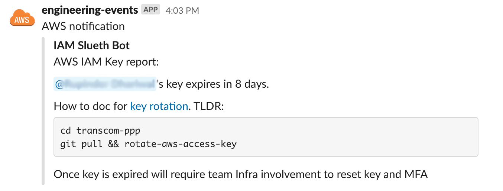
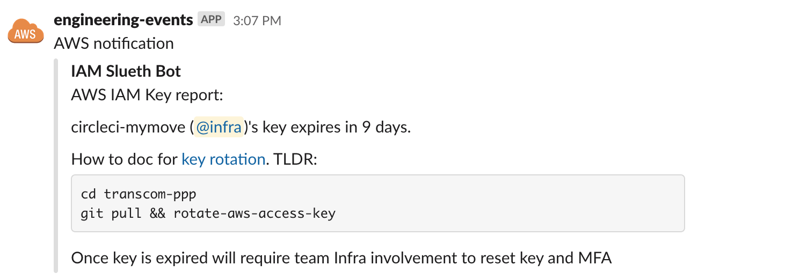
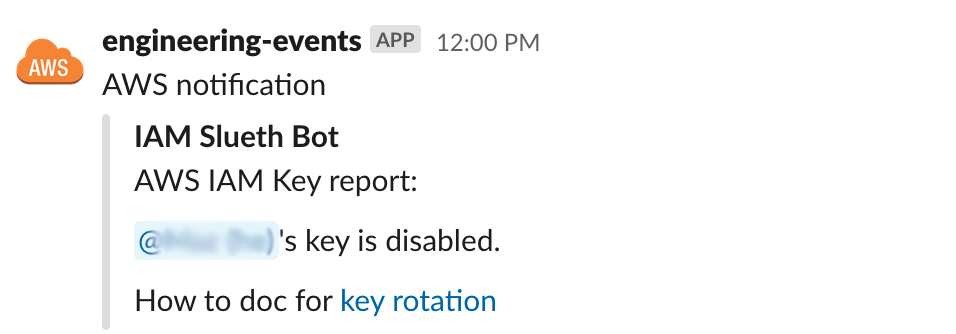

# AWS Key Sleuth

[Changelog](./CHANGELOG.md)

<!-- markdownlint-disable MD013 MD033  -->
<!-- BEGINNING OF PRE-COMMIT-TERRAFORM DOCS HOOK -->
## Requirements

No requirements.

## Providers

| Name | Version |
|------|---------|
| aws | n/a |

## Inputs

| Name | Description | Type | Default | Required |
|------|-------------|------|---------|:--------:|
| schedule | Schedule to run the audit. Default daily between M-F at 18:00 UTC | `string` | `"cron(0 18 ? * MON-FRI *)"` | no |
| sns\_topic\_arn | SNS topic to send messages to, to be routed to slack-notify | `string` | n/a | yes |

## Outputs

No output.

<!-- END OF PRE-COMMIT-TERRAFORM DOCS HOOK -->

## What is this for

An auditing tool for AWS keys that audits, alerts, and disable keys if not within compliance settings. This reduces AWS administrator involvement since majority of users will cycle key before being disabled.

## How does this work

Sleuth runs periodically, normally once a day in the middle of business hours. Sleuth does the following:

- Inspect each Access Key based on set age threshold (default 90 days)
- If Access Key is approaching threshold will ping user with a reminder to cycle key
- If key age is at or over threshold will disable Access Key along with a final notice

Notifications can be sent directly to Slack using a V1 token or through SNS Topic.

## Usage

### Setup

This tool depends on an external non-published TF module. As of time of writing this is a manual process for now.

```bash
cd WORK_DIR
git clone https://github.com/ruzin/terraform_aws_lambda_python.git
cd terraform_aws_lambda_python
git remote add retentionscience git@github.com:retentionscience/terraform_aws_lambda_python.git
git checkout retentionscience/master
```

Now pull down the Sleuth private TF module

```bash
cd WORK_DIR
git clone https://github.com/trussworks/aws-iam-sleuth/
```

### Configure Environment

Sleuth relies on IAM Tags to know the Slack account/group ID to mention when assembling the notification. Specifically `Name` and `Slack` tags. A sample of a TF IAM user is below

```hcl
resource "aws_iam_user" "tfunke" {
  name = "tfunke"

  tags = {
    Name       = "Tobias Funke"
    Slack      = "UPML12345"
  }
}
```

For a Slack user the standard SlackID is suffecient. For a group the `Slack` tag must have a value of the form `subteam-SP12345` (no `^` is allowed). More info on Slack group identifiers [here](https://api.slack.com/reference/surfaces/formatting#mentioning-groups).

For listing Slack account IDs in bulk look at the [user_hash_dump.py](./scripts/user_hash_dump.py) script.

If the information isn't specified an error will be thrown in the logs and the plain text username will be in the notification.

#### Deploy

Now all the dependencies are ready and the environment is prepped for Sleuth usage we can now deploy the lambda.

```hcl
module "iam_sleuth" {
  source = "../to/module/aws-api-key-sleuth"
  sns_topic_arn = data.aws_sns_topic.slack_events.arn
}
```

## Screenshots

A user is pinged directly with an AWS key 8 days before of the 90 day limit.



For IAM accounts that are used by bots such as Jenkins or CircleCI Sleuth can ping a group such as Infra or Engineers to ensure the account does not get disabled by accident.



A user failed to cycle their AWS key. Sleuth disabled the out of compliant key and posts a single notification to the user. This is the last notification the user will receive.



## Developer Setup

Install dependencies:

```sh
brew install circleci pre-commit terraform python
pre-commit install --install-hooks
```
